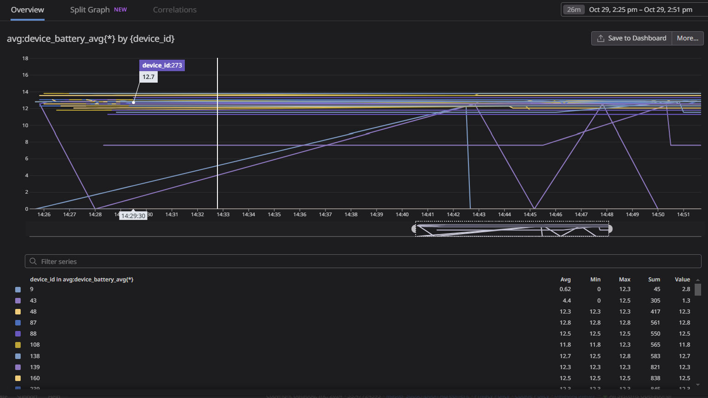
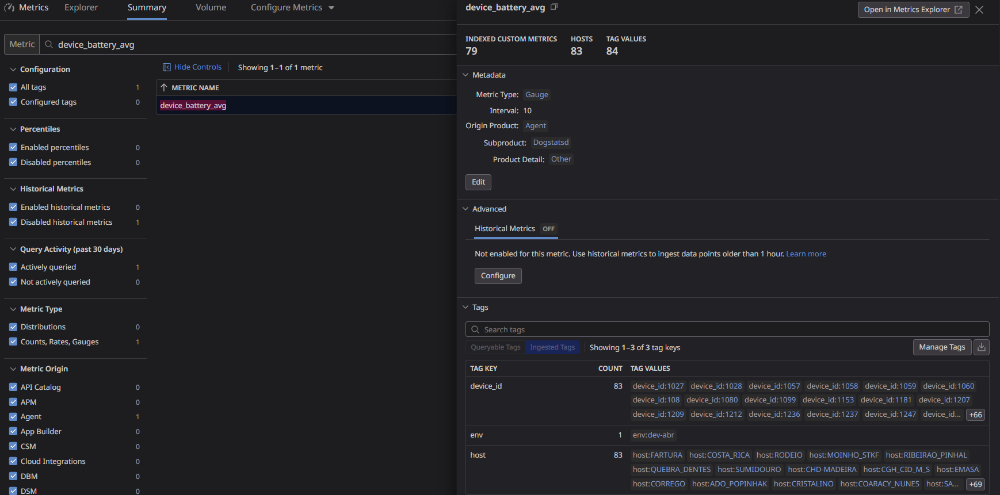

# Envio de metricas de dispositivos, via dogstatsd

### Origem do dado
- Dispositivos coletados consultando API
- Após lista de dispositivos, é feita a consulta individual do nível medio da bateria de cada dispositivo e enviada ao datadog

### Como utilizar
Basta executar o script abaixo informando os dados necessários (não recomendo consultas por periodo longs)
```
Usage: battery_avg2datadog.py <ENV> <AUTHTOKEN> '<DATA_INICIAL>' '<DATA_FINAL>'
       ENV: tag para definição de environemnt no datadog
       AUTHTOKEN: tocken authentication api
       DATA_INICIAL: '2024-10-28 00:00:00'
       DATA_FINAL: '2024-10-28 01:00:00'
```
Outra opção é colocar este script num "crontab da vida", assim é possível uma recorrencia em periodos adequados de consulta.

### No datadog teremos a seguinte visão:
Em Metrics, Explorer. Teremos a visão da metrica procurando por: device_battery_avg, como na imagem abaixo:



e a visão de Metrics, Summatry, filtrando por device_battery_avg



### Requerimentos
Para o funcionamento do script é necessário instalar suas dependencias (requirements.txt), assim como ter um host com agent do datadog instalado (preferencialmente o mesmo onde for rodar o script).
